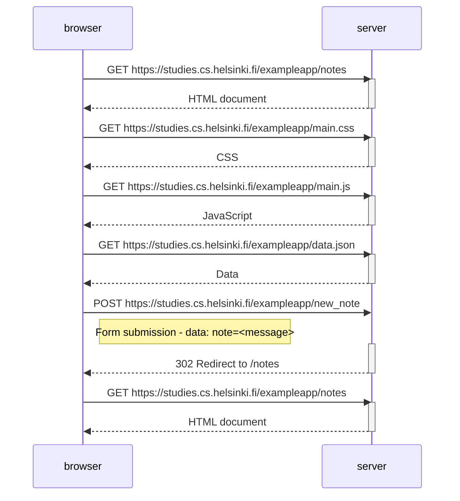

```mermaid

sequenceDiagram
    participant browser
    participant server

    browser->>server: GET https://studies.cs.helsinki.fi/exampleapp/notes

    activate server
    server-->>browser: HTML document
    deactivate server

    browser->>server: GET https://studies.cs.helsinki.fi/exampleapp/main.css

    activate server
    server-->>browser: CSS
    deactivate server

    browser->>server: GET https://studies.cs.helsinki.fi/exampleapp/main.js

    activate server
    server-->>browser: JavaScript
    deactivate server

    browser->>server: GET https://studies.cs.helsinki.fi/exampleapp/data.json

    activate server
    server-->>browser: Data
    deactivate server


    browser->>server: POST https://studies.cs.helsinki.fi/exampleapp/new_note
    Note right of browser: Form submission - data: note=<message>

    activate server
    server-->>browser: 302 Redirect to /notes
    deactivate server


    browser->>server: GET https://studies.cs.helsinki.fi/exampleapp/notes

    activate server
    server-->>browser: HTML document
    deactivate server


```
