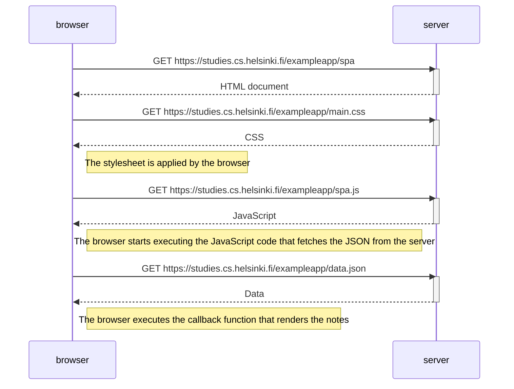

```mermaid

sequenceDiagram
    participant browser
    participant server

    browser->>server: GET https://studies.cs.helsinki.fi/exampleapp/spa


    activate server
    server-->>browser: HTML document
    deactivate server

    browser->>server: GET https://studies.cs.helsinki.fi/exampleapp/main.css

    activate server
    server-->>browser: CSS
    deactivate server
    Note right of browser: The stylesheet is applied by the browser

    browser->>server: GET https://studies.cs.helsinki.fi/exampleapp/spa.js


    activate server
    server-->>browser: JavaScript
    deactivate server
    Note right of browser: The browser starts executing the JavaScript code that fetches the JSON from the server

    browser->>server: GET https://studies.cs.helsinki.fi/exampleapp/data.json


    activate server
    server-->>browser: Data
    deactivate server

    Note right of browser: The browser executes the callback function that renders the notes


```
