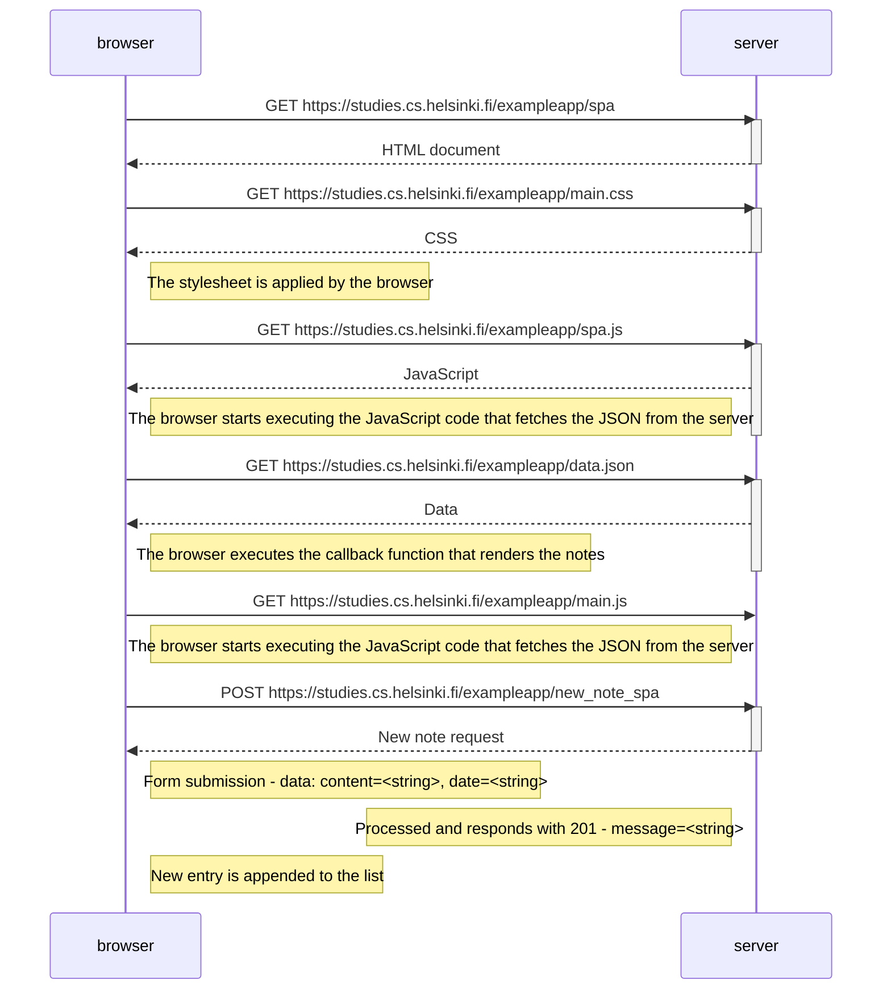

```mermaid

sequenceDiagram
    participant browser
    participant server

    browser->>server: GET https://studies.cs.helsinki.fi/exampleapp/spa


    activate server
    server-->>browser: HTML document
    deactivate server

    browser->>server: GET https://studies.cs.helsinki.fi/exampleapp/main.css

    activate server
    server-->>browser: CSS
    deactivate server
    Note right of browser: The stylesheet is applied by the browser

    browser->>server: GET https://studies.cs.helsinki.fi/exampleapp/spa.js

    activate server
    server-->>browser: JavaScript
        Note right of browser: The browser starts executing the JavaScript code that fetches the JSON from the server

    deactivate server

    browser->>server: GET https://studies.cs.helsinki.fi/exampleapp/data.json

    activate server
    server-->>browser: Data

    Note right of browser: The browser executes the callback function that renders the notes
    deactivate server

    browser->>server: GET https://studies.cs.helsinki.fi/exampleapp/main.js

    Note right of browser: The browser starts executing the JavaScript code that fetches the JSON from the server

    browser->>server: POST https://studies.cs.helsinki.fi/exampleapp/new_note_spa
    activate server
    server-->>browser: New note request
    deactivate server
    Note right of browser: Form submission - data: content=<string>, date=<string>
    Note left of server: Processed and responds with 201 - message=<string>
    Note right of browser: New entry is appended to the list

```
